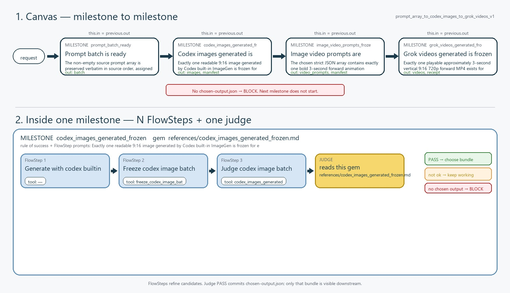

# Prompt array to Codex images to Grok videos

[](https://github.com/dse120071750/m8m-harness-builder)
[](LICENSE)

An open-source M8M workflow that turns an ordered array of editorial image
prompts into:

1. one vertical 9:16 still per prompt using Codex built-in ImageGen;
2. one image-grounded motion prompt per still; and
3. one three-second forward MP4 per still using a persistent Grok Build ACP
   session.

The workflow is deliberately strict about provenance. It preserves source
order, checks every generated asset, commits only judge-approved milestone
bundles, and never falls back to an image or video REST API.



## Workflow

```text
prompt_batch_ready
  -> codex_images_generated_frozen
  -> image_video_prompts_frozen
  -> grok_videos_generated_frozen
```

| Milestone | Chosen output ports |
| --- | --- |
| `prompt_batch_ready` | `batch` |
| `codex_images_generated_frozen` | `images`, `manifest` |
| `image_video_prompts_frozen` | `video_prompts`, `manifest` |
| `grok_videos_generated_frozen` | `videos`, `receipt` |

Every milestone is a real M8M v4 canvas node with a success rule, output
schema, named ports, and a judge. Downstream milestones can read only the
current run's `chosen-output.json` bundles.

## Requirements

- Codex with the built-in `image_gen` and `view_image` tools.
- [M8M Harness Builder 2.0](https://github.com/dse120071750/m8m-harness-builder).
- Python 3.10 or newer.
- Node.js and npm, used only to install repository-local FFmpeg and ffprobe
  binaries.
- Grok Build installed and authenticated with `grok login`.
- Grok Build privacy disabled, or complete user-hosted ZDR video storage in
  `~/.grok/managed_config.toml`.

This project does not install Grok Build, authenticate accounts, change privacy
settings, provision storage, or use `XAI_API_KEY`.

## Install

Clone this repository, then install the deterministic runtime dependencies:

```powershell
pip install -r requirements.txt
npm install
```

Install M8M Harness Builder for Codex:

```powershell
npx skills add dse120071750/m8m-harness-builder
```

The product skill is already repo-local at
`.agents/skills/prompt-array-to-codex-images-to-grok-videos/SKILL.md`. A Claude
Code copy is included under `.claude/skills/`.

## Run

Create a request containing exactly one non-empty `prompts` array. See
[`examples/request.example.json`](examples/request.example.json).

```powershell
$m8mBuilder = Join-Path $env:USERPROFILE '.codex\skills\m8m-harness-builder'
python "$m8mBuilder\scripts\run_flow.py" `
  --codebase (Get-Location) `
  --flow-id prompt_array_to_codex_images_to_grok_videos_v1 `
  --request examples/request.example.json
```

The first intelligent milestone returns `ACTION_REQUIRED`. Start a fresh,
no-history Codex worker from the emitted `context_capsule_path`. The worker may
read only `allowed_files` and write only `write_file`. It must use built-in
`image_gen` once per prompt.

Resume the same run with the resulting draft:

```powershell
python "$m8mBuilder\scripts\run_flow.py" `
  --codebase (Get-Location) `
  --flow-id prompt_array_to_codex_images_to_grok_videos_v1 `
  --run-mode resume `
  --run-dir <exact-run-dir> `
  --draft <draft.json>
```

The next `ACTION_REQUIRED` worker must inspect every frozen still with
`view_image` before writing the ordered motion-prompt draft. Resume again. The
final milestone then runs the persistent Grok Build ACP session and validates
every MP4.

## Export the public result

After the run reports `COMPLETE`:

```powershell
python scripts/export_results.py <exact-run-dir> --output result.json
```

The exported JSON has this shape:

```json
[
  {
    "index": 0,
    "image_prompt": "source editorial prompt verbatim",
    "image_path": "absolute chosen image path",
    "video_prompt": "image-grounded motion prompt",
    "video_path": "absolute chosen MP4 path"
  }
]
```

Attempt paths, generated-image source paths, ACP transcripts, and judge
receipts are intentionally excluded.

## Validate and test

```powershell
$m8mBuilder = Join-Path $env:USERPROFILE '.codex\skills\m8m-harness-builder'
python "$m8mBuilder\scripts\validate_harness.py" `
  --codebase (Get-Location) `
  --flow-id prompt_array_to_codex_images_to_grok_videos_v1
python scripts/run_tests.py
```

The tests use local fixtures and fake ACP clients; they do not generate paid
media.

## Privacy and run artifacts

- All run state is stored under `flowsteps/runs/` and ignored by Git.
- ACP transcripts can contain prompts and provider responses. Keep run folders
  private unless you have reviewed them.
- `.env`, media outputs, caches, credentials, and generated images are ignored.
- Failed batches remain diagnostic attempts but are never selected as chosen
  outputs.

## License

MIT. See [`LICENSE`](LICENSE).

Codex, Grok, OpenAI, and xAI are trademarks of their respective owners. This
community workflow is not an official OpenAI or xAI product.
